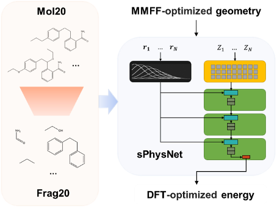

# sPhysNet

### [Dataset Construction to Explore Chemical Space with 3D Geometry and Deep Learning](https://pubs.acs.org/doi/abs/10.1021/acs.jcim.1c00007)



### Table of Contents

- Project Organization
- Environment Setup
- Tutorial
- References

---
### 1. Project Organization

```
|- README.md                                <- this file
|- tutorial.ipynb                           <- A tutotial file for data preprocessing and sPhysNet training
|- PhysDime-Seq                             <- Main code of PhysNet architecture, irrelevant files are omitted.
    |- Networks
    |- utils
    |- train.py
    |- test.py
    |- config-sPhysNet-Frag20-eMol9-QM.txt
    |- subjob-testing.pbs
|- dataProviders                            <- Main code for data preprocessing and loading, irrelevant files are omitted
    |- GaussUtils
    |- DataPrepareUtils.py
    |- DummyIMDataset.py
    |- frag20_eMol9_split.pt
```

### 2. Environment Setup

Install the following packages:

- Python 3.7

`$ conda install python==3.7`

- [Rdkit](https://www.rdkit.org/docs/Install.html)

`$ conda install -c rdkit rdkit`

- [PyTorch](https://pytorch.org/)

Installation depends on system. Please install 1.6.0 or newer version

- [PyTorch geometric](https://pytorch-geometric.readthedocs.io/en/latest/notes/installation.html)

Please follow the instruction on the website.

- [Warmup Scheduler](https://github.com/ildoonet/pytorch-gradual-warmup-lr)

`$ pip install git+https://github.com/ildoonet/pytorch-gradual-warmup-lr.git`

- [SymPy](http://www.cfm.brown.edu/people/dobrush/am33/SymPy/install.html)

`$ pip install sympy`

- [Deprecated](https://pypi.org/project/Deprecated/)

`$ pip install Deprecated`

- [GPyTorch](https://gpytorch.ai/)

`$ pip install gpytorch`

### 3. Tutorial

Please follow this Jupyter Notebook: [tutorial.ipynb](https://github.com/SongXia-NYU/sPhysNet/blob/main/tutorial.ipynb)

### 4. References

- This is the official implementation of the paper [Dataset Construction to Explore Chemical Space with 3D Geometry and Deep Learning](https://pubs-acs-org.proxy.library.nyu.edu/doi/10.1021/acs.jcim.1c00007)
- Thanks for the [TensorFlow version of PhysNet](https://github.com/MMunibas/PhysNet).


---

